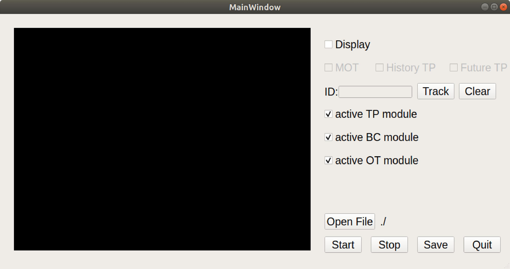

# E2E Bahavior Classification
This project is the implementation of my thesis: **End-To-End System For Road Agents Behavior Classification Based On Dash Cam Image**, in the following will describe how this project work, what and how dataset is used.

<p align="center">
  
</p>

## Abstract
> The classification of road agents' behavior is an important study in the field of self-driving. Identifying which road agents are inclined to dangerous or normal behavior during the driving process can improve the safety of the driving process. In addition to the importance of road agent behavior classification in the field of self-driving, it can also achieve a certain degree of driving assistance to remind and advise the driver to reduce the risk of driving in the process. The system can use the results of multi-object tracking to form a historical trajectory, and by turning on trajectory prediction, the system can predict the future path, and then use the historical and predicted trajectory to classify individual road agents as aggressive or conservative drivers, and use overtaking assistance to provide users with driving recommendations under normal conditions. We also design a highly efficient parallelization system for the dependency and independence of the input and output of each module, so that the whole system can reach the speed of real-time detection.

## Installation

### Enviornment

- Python: 3.7
- Pytorch: 1.10.0
- CUDA: 10.2
- cuDNN: 8.0.3.33-1
- TensorRT: 7.1.3-1

How to install this Project:
```sh
git clone https://github.com/leisurecodog/E2E-Behavior-Classification.git
pip install requirements.txt
```

**The pipeline version is no longer maintained**, all of newest implementation is placed in **parallel** folder, if you need to run pipeline version, please follow the parallel version to modify.

How to run this project:
```sh
cd parallel
python system_main.py
```
And the UI will be displayed like below image:



### Usage

- MOT: Multiple Object Tracking, modified from [ByteTrack](https://github.com/ifzhang/ByteTrack).

- TP: Trajectory Prediction, modified from [DDPG](https://github.com/ghliu/pytorch-ddpg).
- BC: Behavior Classification, modified from [GraphRQI](https://github.com/rohanchandra30/GraphRQI).
- OT: Overtaking Assistance, combined from PINet, Yolact_Edge and our overtaking detection algorithm.

If you want to modify the module, please follow the above abbreviation description to find corresponding folder.

If you want to replace the module, you need to rewrite the corresponding file in the module folder, such as TP_module/TP.py

## Dataset
### BDD100K/BDD100K MOT
BDD100K: [link](https://www.bdd100k.com/)<br>
This dataset is used to Training Multiple Object Tracking, Trajectory Prediction and Behavior Classification. <br>for training the Behavior Classification, you need to label data by self, bolow is the example of label file a frame :
```sh
# label format: object_id, behavior label.
# 0 means conservative, 1 means aggressive.
1, 0 
2, 1
...
```

### KITTI/KITTI Tracking
KITTI: [link](http://www.cvlibs.net/datasets/kitti/)<br>
### CEO Videos

We will upload part of our label file to there for more clear description.